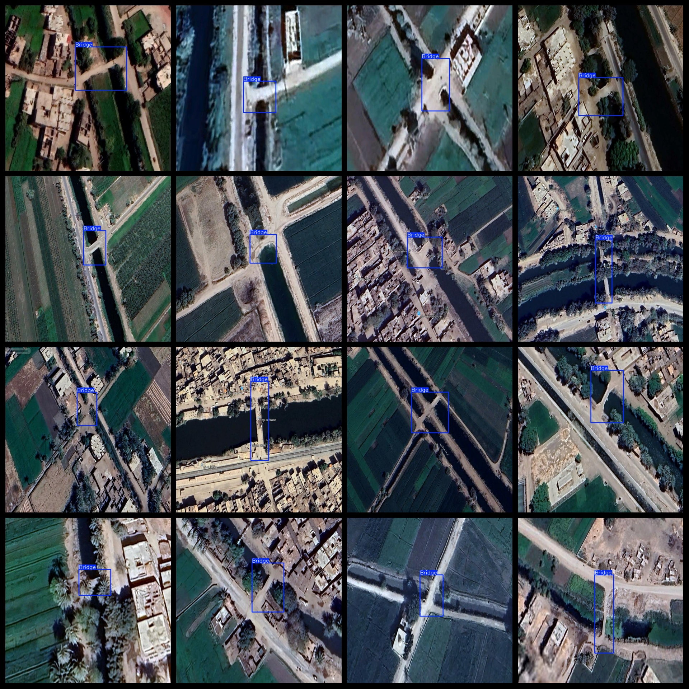

# UAV Aerial Bridge Dataset 1497 images, VOC+YOLO format

The UAV Aerial Bridge Dataset consists of 1497 images in both VOC and YOLO formats.

The dataset is organized in the following format: Pascal VOC format + YOLO format (excluding the split paths in txt files, only including JPG images along with their corresponding VOC format xml files and YOLO format txt files).

The number of images (JPG file count): 1497

The number of annotations (xml file count): 1497

The number of annotations (txt file count): 1497

The number of annotation categories: 1

The repository where the dataset is located: datasets_sl

Annotation category name: ["Bridge"]

The number of bounding boxes for each category:

Bridge bounding box count = 1691

Total bounding box count: 1691

The number of images occupied by each category:

Bridge occupied images count = 1497

Image resolution: 640x640

Using an annotation tool: labelImg

Dataset enhancement status: No

Annotation rules: Draw bounding boxes for categories

Important Note: The dataset does not have a separate training, validation, or test split; it needs to be divided accordingly.

Special Remark: This dataset does not guarantee any accuracy for models trained on it or weight files.

The annotations and images are as follows:

## Images

---

Here is a pay link on Stripe (https://buy.stripe.com/3cs8yP7sY87d0vu9AB). Please contact me lonlonago@foxmail.com after funding $89, and I will send you a complete data files, thank you!

